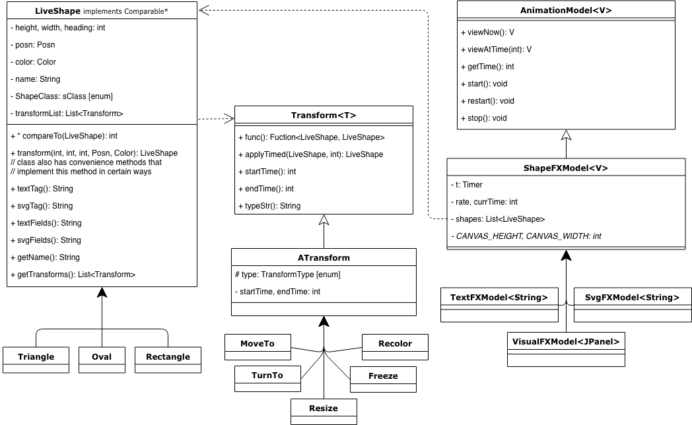

# AnimationModel
The AnimationModel interface contains the methods necessary of keeping track of time, storing shapes, and outputing the states of those shapes at certain times

## ShapeFXModel
This model implements the methods of AnimationModel in ways that will reduce redundant code when different models will need to be created

#### PrintFXModel
This model outputs the state of the shapes as Strings formatted by the Text format

# LiveShapes
LiveShapes are different kinds of shapes (Oval, Rectangle, Triangle) that have stored transforms. The LiveShapes are mutable, but they aren't directly mutated by the Transformations. The LiveShapes are copied and then mutated.

# Transforms
Transforms contain Functions that transform LiveShapes, and also have time-based logic for applying those function objects. The applyTimed method returns a what a given LiveShape's state would be if it were to be (or have been) transformed by this transformation at any given time.

# Class Architecture

